# Reading Memory — Application Architecture

## System Diagram

```mermaid
flowchart TD
    %% ─────────────────────────────────────────────
    %% EXTERNAL SERVICES
    %% ─────────────────────────────────────────────
    subgraph EXT["External Services"]
        direction TB
        GH["GitHub\nVersion control"]
        VERCEL["Vercel\nHosting & deployment"]
        OL["Open Library API\nopenlibrary.org"]
        GB["Google Books API\ngoogleapis.com/books"]
        TESS["Tesseract.js\nWASM OCR engine"]
        BM["BookManager / Ladybird Books\nladybirdbooks.org\nPurchase destination"]
    end

    GH -->|"auto-deploy on push"| VERCEL

    %% ─────────────────────────────────────────────
    %% FRONTEND — Next.js 16 (App Router, all client)
    %% ─────────────────────────────────────────────
    subgraph FE["Frontend — Next.js 16 (Vercel)"]
        direction TB

        subgraph PAGES["Pages"]
            HOME["🏠 Homepage\n· Stats hero\n· Favorite Authors\n· Books You Might Like\n· Pre-Orders\n· Library preview"]
            LIB["📚 Library\n· Full book table\n· Search / filter"]
            AUTH_P["👤 Authors\n· Favorite author cards\n· Book count badges"]
            AUTH_D["👤 Author Detail\n· Author bio\n· All books by author"]
            DISC["🙈 Hidden\n· Disliked books & authors"]
            IMPORT_P["⚙️ Import CSV\n· Drop zone\n· Replace-confirm dialog"]
        end

        subgraph MODAL["Add Book Modal"]
            BARCODE["📷 Scan Barcode\n(file / camera input)"]
            COVER["🖼 Cover Photo OCR\n(file / camera input)"]
            MANUAL["✏️ Manual Entry\nform (title, author, genre)"]
        end

        subgraph STATE["Global State (React Context)"]
            PREFS["PreferencesProvider\n· importedBooks[]\n· importedFavoriteAuthors[]\n· importedAuthorNames[]\n· dislikedBookIds[]\n· isLoading / loadError"]
        end

        subgraph HOOKS["Data-Fetching Hooks"]
            HNA["useNewArrivals()\nBooks You Might Like"]
            HAB["useAuthorBooks()\nPre-orders"]
            HAP["useAuthorPhotos()\nAuthor avatars"]
        end
    end

    %% ─────────────────────────────────────────────
    %% API LAYER — Express.js (Vercel serverless)
    %% ─────────────────────────────────────────────
    subgraph API["API Layer — Express.js (api/index.js → Vercel Serverless)"]
        direction TB
        GET_LIB["GET /api/library\nReturn all books"]
        POST_LIB["POST /api/library\nAdd one book (source: manual)"]
        DEL_LIB["DELETE /api/library/:id\nRemove a book"]
        GET_AUTH["GET /api/authors\nReturn qualified favorites"]
        POST_AUTH["POST /api/authors\nAdd / un-hide an author"]
        DEL_AUTH["DELETE /api/authors/:id\nHide an author"]
        POST_IMP["POST /api/import\nBulk-replace CSV books\n(never touches manual records)"]
        SYNC["syncAuthors()\n≥2-book rule enforced\nafter every mutation"]
    end

    %% ─────────────────────────────────────────────
    %% DATABASE — Turso / libSQL (SQLite)
    %% ─────────────────────────────────────────────
    subgraph DB["Database — Turso (libSQL / SQLite)"]
        direction LR
        T_BOOKS["books\n─────────────\nid TEXT PK\ntitle TEXT\nauthor TEXT\ngenre TEXT\ndate_ordered TEXT\nunit_price TEXT\ntotal_amount TEXT\norder_status TEXT\norder_id TEXT\nsource TEXT  ← 'csv' | 'manual'\ncreated_at INTEGER"]
        T_AUTH["authors\n─────────────\nid TEXT PK\nname TEXT UNIQUE\nis_hidden INTEGER\nis_manual INTEGER\ncreated_at INTEGER"]
    end

    %% ─────────────────────────────────────────────
    %% FRONTEND → API FLOWS
    %% ─────────────────────────────────────────────

    %% App load
    PREFS -->|"GET /api/library\nGET /api/authors\n(on mount)"| GET_LIB
    PREFS -->|"GET /api/authors"| GET_AUTH

    %% CSV import
    IMPORT_P -->|"parse CSV → POST /api/import"| POST_IMP

    %% Camera scan
    BARCODE -->|"ZXing decodes EAN-13/ISBN"| GB
    COVER   -->|"Tesseract.js OCR → text query"| TESS
    TESS    -->|"extracted text"| GB
    GB      -->|"book metadata"| MODAL
    MODAL   -->|"POST /api/library"| POST_LIB

    %% Manual entry
    MANUAL  -->|"POST /api/library"| POST_LIB

    %% Delete / hide
    LIB     -->|"DELETE /api/library/:id"| DEL_LIB
    AUTH_P  -->|"DELETE /api/authors/:id"| DEL_AUTH

    %% ─────────────────────────────────────────────
    %% API → DATABASE FLOWS
    %% ─────────────────────────────────────────────
    GET_LIB  -->|"SELECT * FROM books"| T_BOOKS
    POST_LIB -->|"INSERT INTO books\nsource='manual'"| T_BOOKS
    DEL_LIB  -->|"DELETE FROM books"| T_BOOKS
    POST_IMP -->|"DELETE csv rows\nINSERT new rows\nsource='csv'"| T_BOOKS

    GET_AUTH  -->|"SELECT FROM authors\nJOIN books (count)"| T_AUTH
    POST_AUTH -->|"INSERT / UPDATE authors"| T_AUTH
    DEL_AUTH  -->|"UPDATE is_hidden=1"| T_AUTH

    POST_LIB  --> SYNC
    DEL_LIB   --> SYNC
    POST_IMP  --> SYNC
    SYNC -->|"INSERT qualified authors\n(≥2 books)"| T_AUTH
    SYNC -->|"DELETE authors\n(dropped below threshold)"| T_AUTH

    %% ─────────────────────────────────────────────
    %% RECOMMENDATION & DISCOVERY FLOWS
    %% ─────────────────────────────────────────────
    PREFS -->|"importedAuthorNames[]"| HNA
    PREFS -->|"importedAuthorNames[]"| HAB
    HNA   -->|"subject + published_in query"| OL
    HAB   -->|"author + sort=new query"| OL
    OL    -->|"book metadata + cover IDs"| HNA
    OL    -->|"book metadata + cover IDs"| HAB
    HNA   -->|"arrivals[]"| HOME
    HAB   -->|"preOrders[]"| HOME

    %% Author photos
    PREFS -->|"importedAuthorNames[]"| HAP
    HAP   -->|"author name search"| OL
    OL    -->|"photo URLs"| HAP
    HAP   -->|"photos Map<name,url>"| AUTH_P

    %% Purchase flow
    HOME  -->|"ladybirdSearchUrl(title, author)\n/browse/filter/k/keyword/t/…"| BM
    LIB   -->|"Buy at Ladybird button"| BM

    %% ─────────────────────────────────────────────
    %% DEPLOYMENT
    %% ─────────────────────────────────────────────
    VERCEL -->|"serves Next.js frontend"| FE
    VERCEL -->|"runs Express as serverless fn\napi/index.js"| API
    API    <-->|"libsql HTTP protocol\nTURSO_DATABASE_URL\nTURSO_AUTH_TOKEN"| DB

    %% ─────────────────────────────────────────────
    %% STYLING
    %% ─────────────────────────────────────────────
    classDef page    fill:#f0ece4,stroke:#c8b89a,color:#1a1a1a
    classDef api     fill:#e8f0fe,stroke:#7baaf7,color:#1a1a1a
    classDef db      fill:#e6f4ea,stroke:#81c995,color:#1a1a1a
    classDef ext     fill:#fce8e6,stroke:#f28b82,color:#1a1a1a
    classDef hook    fill:#fef7e0,stroke:#f9ab00,color:#1a1a1a
    classDef state   fill:#f3e8fd,stroke:#b388ff,color:#1a1a1a
    classDef modal   fill:#e8f5e9,stroke:#66bb6a,color:#1a1a1a

    class HOME,LIB,AUTH_P,AUTH_D,DISC,IMPORT_P page
    class GET_LIB,POST_LIB,DEL_LIB,GET_AUTH,POST_AUTH,DEL_AUTH,POST_IMP,SYNC api
    class T_BOOKS,T_AUTH db
    class GH,VERCEL,OL,GB,TESS,BM ext
    class HNA,HAB,HAP hook
    class PREFS state
    class BARCODE,COVER,MANUAL modal
```

---

## Plain-English Summary

### Frontend (Next.js — all client-side)

- **What it owns:** Every page the user sees — Homepage, Library, Authors, Author Detail, Hidden items, Import CSV settings, and the Add Book modal.
- **State management:** A single React Context (`PreferencesProvider`) holds the in-memory library state (`importedBooks`, `importedFavoriteAuthors`, dislike lists). On every page load it calls `GET /api/library` and `GET /api/authors` to hydrate from the database.
- **Discovery hooks:** Three custom hooks (`useNewArrivals`, `useAuthorBooks`, `useAuthorPhotos`) call the Open Library API directly from the browser to power the "Books You Might Like", "Pre-Orders", and author avatar features. Results are cached in module-level session state so they don't refetch on every navigation.
- **No localStorage for library data** — all persistent state lives in Turso. Only the dislike lists are stored in `localStorage`.

### Backend (Express.js — Vercel Serverless)

- **What it owns:** Six REST endpoints split across three concerns — library CRUD, author management, and bulk CSV import.
- **Favourite Authors rule:** The `syncAuthors()` helper runs after every mutation (add, delete, import) and enforces the ≥ 2-books threshold: authors who qualify are promoted, those who drop below are removed. Manual authors (`is_manual = 1`) are never auto-removed.
- **Import safety:** `POST /api/import` runs inside an atomic libSQL batch. It only deletes rows with `source = 'csv'` — manually scanned or entered books are untouched by any CSV re-import.
- **Graceful degradation:** If the database is unavailable, read endpoints return empty arrays (200) and the UI shows an empty library rather than an error screen.

### Database (Turso — hosted libSQL / SQLite)

| Table | Purpose |
|---|---|
| `books` | Every book the user owns. The `source` column (`'csv'` or `'manual'`) determines whether a CSV re-import can delete the row. |
| `authors` | Qualified favourite authors (≥ 2 books). `is_hidden` lets users dismiss an author without deleting it; `is_manual` protects manually-added authors from auto-removal. |

### External Services

| Service | Why it's used |
|---|---|
| **Open Library API** | Free, no-key-required source for new-arrival discovery (filtered by genre and author), pre-order detection, and author portrait photos. |
| **Google Books API** | Book metadata lookup during camera scan — supports both ISBN (from barcode) and free-text (from OCR) queries. No API key required for basic usage. |
| **Tesseract.js** | In-browser WASM OCR engine. Extracts title text from a cover photo so the app can search Google Books without the user typing anything. Loaded dynamically to avoid bloating the initial bundle. |
| **@zxing/browser** | In-browser barcode decoder. Reads EAN-13 / ISBN-13 barcodes from a photo or uploaded image. Also loaded dynamically. |
| **Ladybird Books (BookManager)** | The purchase destination. All "Buy" links use the BookManager deep-search URL format: `/browse/filter/k/keyword/t/{title author}`, which routes directly to search results in the store's SPA. |
| **Vercel** | Hosts the Next.js frontend and runs the Express API as a Node.js serverless function (`api/index.js`). |
| **GitHub** | Source control. Every push to `main` triggers an automatic Vercel deployment. |
